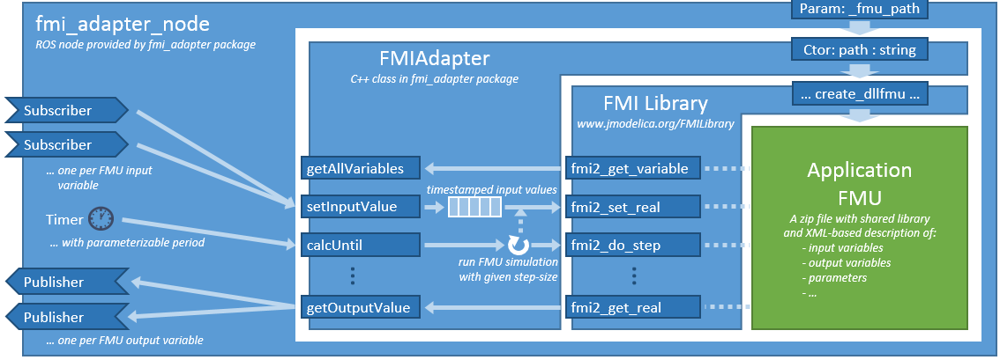
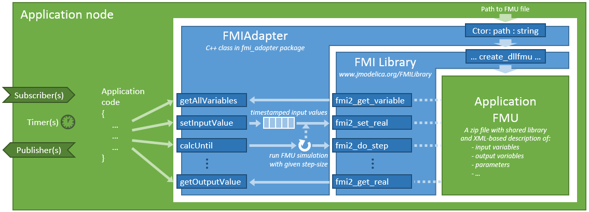

General information about this repository, including legal information, build instructions and known issues/limitations, are given in [README.md](../README.md) in the repository root.


# The fmi_adapter package

fmi_adapter is a small [ROS 2](http://www.ros.org/) package for wrapping *functional mockup units (FMUs)* for co-simulation of physical models into ROS nodes. FMUs are defined in the [FMI standard](http://fmi-standard.org/). Currently, this package supports co-simulation FMUs according to the FMI 2.0 standard only.

FMUs can be created with a variety of modeling and simulation tools. Examples are [Dymola](http://www.3ds.com/products-services/catia/products/dymola), [MATLAB/Simulink](https://www.mathworks.com/products/simulink.html), [OpenModelica](https://www.openmodelica.org/), [SimulationX](https://www.simulationx.de/), and [Wolfram System Modeler](http://www.wolfram.com/system-modeler/).

Technically, a co-simulation FMU is a zip file (with suffix .fmu) containing a physical model and the corresponding solver as a shared library together with an XML file describing the inputs, outputs and parameters of the model and details of the solver configuration. An addition, the zip file may contain the source code of the model and solver in the C programming language.


## fmi_adapter_node

fmi_adapter provides a ROS node *fmi_adapter_node* (class [FMIAdapterNode](include/fmi_adapter/FMIAdapterNode.hpp) derived from [LifecycleNode](https://github.com/ros2/rclcpp/blob/master/rclcpp_lifecycle/include/rclcpp_lifecycle/lifecycle_node.hpp)), which takes an FMU and creates subscribers and publishers for the input and output variables of the FMU, respectively. Then, it runs the FMU's solver with a user-definable update period. This approach is illustrated in the following diagram.



The fmi_adapter_node also searches for counterparts for each FMU parameter and variable in the ROS node parameters and initializes the FMU correspondingly.

For this purpose, this package provide a launch file with argument *fmu\_path*. Simply call

```Bash
ros2 launch fmi_adapter fmi_adapter_node.launch.py fmu_path:=[PathToTheFMUFile]
```

Please see the [README.md](../fmi_adapter_examples/README.md) of the [fmi_adapter_examples package](../fmi_adapter_examples/) for a step-by-step description how to use the fmi_adapter_node with a damped pendulum model and FMU.


## fmi_adapter library

fmi_adapter provides a library with convenience functions based on common ROS types to load an FMU during runtime, to retrieve the input, output, and parameter names, to set timestamped input values, to run the FMU's numeric solver, and to query the resulting output. These functions are provided by the class [FMIAdapter](include/fmi_adapter/FMIAdapter.hpp). Instances of this class may be integrated in application-specific ROS nodes or libraries as illustrated in the following architecture diagram.



For parsing the XML description of an FMU and for running the FMU's solver, fmi_adapter uses the C library [FMI Library](http://www.jmodelica.org/FMILibrary). For this purpose, fmi_adapter depends on the [fmilibrary\_vendor](https://github.com/boschresearch/fmilibrary_vendor) package, which downloads and builds the FMI Library using cmake's *externalproject\_add* command.


## Running an FMU inside a ROS node or library

In the following, we give some code snippets how to load and run an FMU file from an application-specific ROS node or library.

**Step 1:** Include the FMIAdapter.hpp from the fmi_adapter package in your C++ code.

```C++
#include "fmi_adapter/FMIAdapter.hpp"
```

**Step 2:** Instantiate the adapter class with the path to the FMU file and the desired simulation step size. If the step-size argument is omitted, the default step size specified in the FMU file will be used.

```C++
rclcpp::Duration stepSize(0.001);
auto adapter = std::make_shared<fmi_adapter::FMIAdapter>(get_logger(), fmuPath, stepSize);
```

**Step 3:** Create subscribers or timers to set the FMU's input values. For example:

```C++
auto subscription = create_subscription<std_msgs::msg::Float64>("angle_x", 1000, 
    [this](std_msgs::msg::Float64::SharedPtr msg) {
      adapter->setInputValue("angleX", now(), msg->data);
    });
```

In this example, `angle_x` is the topic name whereas `angleX` is the corresponding input variable of the FMU.

Use `adapter->getInputVariableNames()` to get a list of all input variables.

**Step 4:** Create a timer or subscriber that triggers the simulation of the FMU using `adapter->doStepsUntil(..)`. For example:

```C++
auto timer = create_wall_timer(update_period,
    [this]() {
      adapter->doStepsUntil(now());
      double y = adapter->getOutputValue("angleY");
      // ... e.g., publish y on a topic ...
    });
```

Use `adapter->getOutputVariableNames()` to get a list of all output variables.

**Step 5:** Set parameters and initial values of the FMU:

```C++
adapter->setInitialValue("dampingParam", 0.21);
adapter->setInitialValue("angleX", 1.3);
```

The function `adapter->initializeFromROSParameters(get_node_parameters_interface())` may be used to initialize all parameters from the corresponding ROS parameters. Please note that all characters in the FMU parameter names that are not supported by ROS are replaced by an '\_', cf. `FMIAdapter::rosifyName(name)`.

**Step 6:** As last setup step, exit the FMU's initialization mode and set the ROS time that refers to the FMU's internal timepoint 0.0.

```C++
adapter->exitInitializationMode(now());
```
