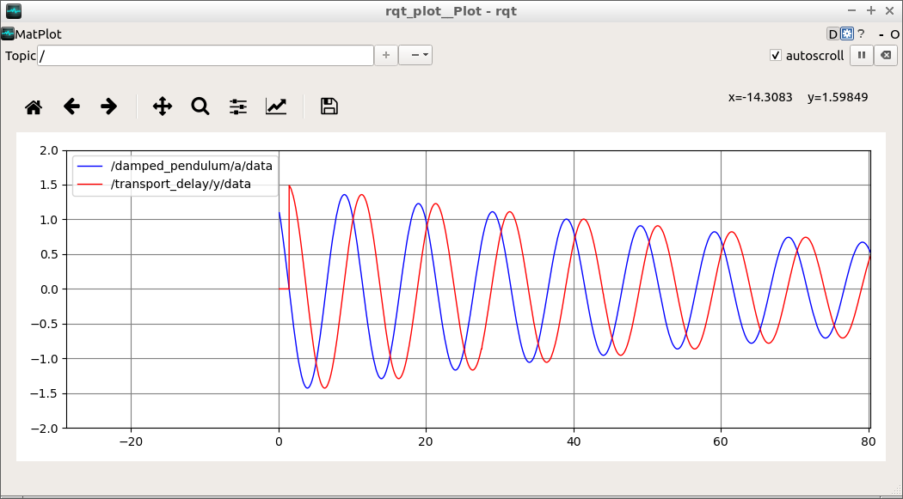
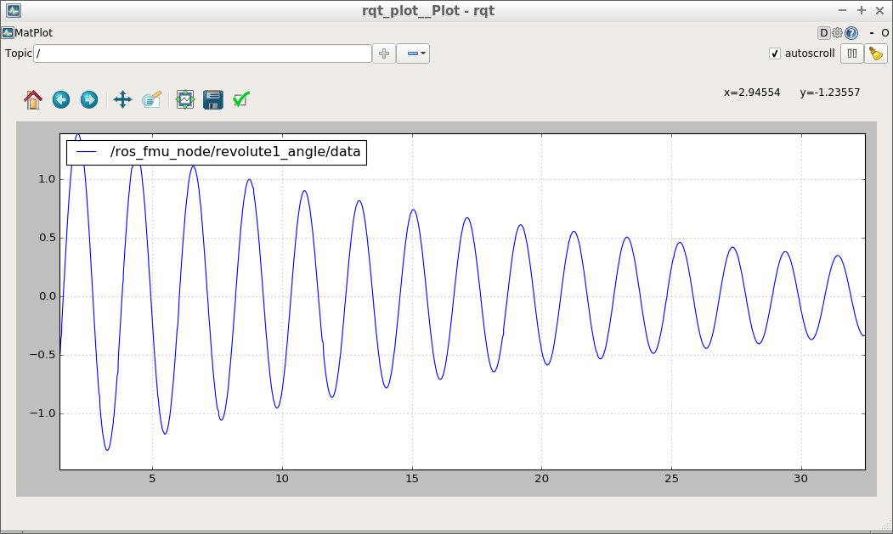

General information about this repository, including legal information, build instructions and known issues/limitations, are given in [README.md](../README.md) in the repository root.

# The fmi_adapter_examples package

This [ROS](http://www.ros.org/) package provides few examples for the use of the fmi_adapter package. It contains two FMU files DampedPendulum.fmu and TransportDelay.fmu (both created with the [FMU SDK](https://www.qtronic.de/en/fmu-sdk/)) and corresponding launch files. Furthermore, it includes a model of a damped pendulum in the [Modelica language](https://www.modelica.org/) to create your own FMU.

## Running the provided sample FMUs

Use `roslaunch fmi_adapter_examples simple_damped_pendulum.launch` to simulate a damped pendulum ([share/DampedPendulum.fmu](share/DampedPendulum.fmu)) with a length of 1m. The pendulum's angle is published at /fmi_adapter_node/a with the default rate of 100Hz. The step size of the FMU's solver is 1ms.

[damped_pendulum_with_transport_delay.launch](launch/damped_pendulum_with_transport_delay.launch) starts two nodes. The first one simulates [share/DampedPendulum.fmu](share/DampedPendulum.fmu), where the length parameter is set to 25m by the launch file. The second node runs [share/TransportDelay.fmu](share/TransportDelay.fmu), where the delay parameter is set to 2.33s. The input subscription of the transport delay is remapped to the pendulum's angle topic and the delayed angle is published at */transport_delay/y*.

Both launch files also open rqt_plot to visualize the angle(s).

## Create and simulate your own DampedPendulum.fmu

There are several modeling tools that support the Modelica language and provide FMU export. Examples are [Dymola](http://www.3ds.com/products-services/catia/products/dymola), [JModelica](https://jmodelica.org/), and [OpenModelica](https://www.openmodelica.org/).

In the following, we explain the process by the example of OpenModelica, which has been also used to create the model of the damped pendulum at [share/DampedPendulum.mo](share/DampedPendulum.mo).

*   Download and install OpenModelica for Linux as described in [https://openmodelica.org/download/download-linux](https://openmodelica.org/download/download-linux).
*   Launch `OMEdit` and load the [share/DampedPendulum.mo](share/DampedPendulum.mo) model file.
*   Click on the DampedPendulum model in the project tree on the left.

*   Navigate to Tools -> Options -> FMI and ensure that `Version=2.0`, `Type=Co-Simulation` and `Platforms=Dynamic` is selected.
*   Then click File -> Export -> FMU.
*   The path of the resulting FMU file is shown in the message browser at the bottom of the window, typically `/tmp/OpenModelica_[user]/OMEdit/DampedPendulum/DampedPendulum.fmu`.

Now, you are prepared for simulating the FMU using the fmi_adapter package.

*   Either use the generic launch file of the package
    `roslaunch fmi_adapter fmi_adapter_node.launch fmu_path:=/tmp/OpenModelica_[user]/OMEdit/DampedPendulum/DampedPendulum.fmu`
    or invoke the package's node directly by
    `rosrun fmi_adapter node _fmu_path:=/tmp/OpenModelica_[user]/OMEdit/DampedPendulum/DampedPendulum.fmu`

*   You may visualize the pendulum's angle over time by
    `rqt_plot /fmi_adapter_node/revolute1_angle`

Please see the [README.md of the fmi_adapter package](../fmi_adapter/README.md) for how to load and run an FMU inside an application-specific ROS node or library.

**Note on bug with mmc_mk_modelica_array in OpenModelica 1.12.0:** If the fmi_adapter node crashes with the error message `undefined symbol: mmc_mk_modelica_array`, please patch the files

*   /usr/include/omc/c/meta/meta_modelica.h
*   /usr/include/omc/c/meta/meta_modelica_data.h

according to [https://github.com/OpenModelica/OMCompiler/pull/2397/files](https://github.com/OpenModelica/OMCompiler/pull/2397/files) and export the FMU again. Details on this bug are given in [https://trac.openmodelica.org/OpenModelica/ticket/4899](https://trac.openmodelica.org/OpenModelica/ticket/4899).
